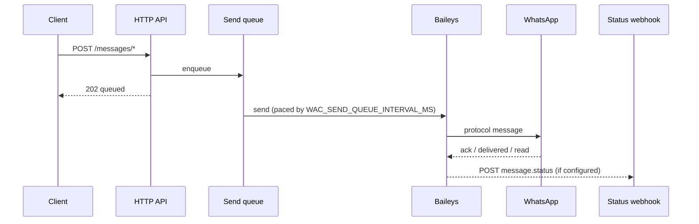
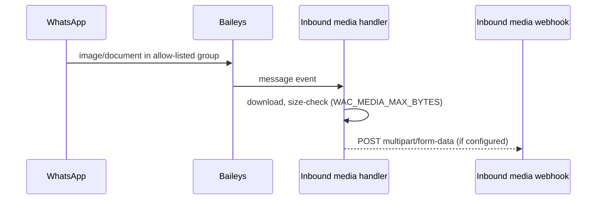

<p align="center">
  
</p>

<h1 align="center">WA Courier</h1>

<p align="center">
  <strong>Self-hosted WhatsApp HTTP gateway — one number, one container, zero external services</strong>
</p>

<p align="center">
  <a href="#-getting-started">Getting Started</a> ·
  <a href="#-configuration">Configuration</a> ·
  <a href="#-http-api">API</a> ·
  <a href="#-webhooks">Webhooks</a> ·
  <a href="#-monitoring">Monitoring</a> ·
  <a href="#-troubleshooting">Troubleshooting</a> ·
  <a href="#-development">Development</a>
</p>

<p align="center">
  
  
  
  
  
  
</p>

## ✨ Overview

WA Courier is a small, self-hosted HTTP gateway for a single WhatsApp number. You pair a
number once by scanning a QR code, and from then on any script, cron job, or workflow on your
network can send messages with a plain HTTP call — and receive files posted into allow-listed
groups through a webhook. One Node process, one Docker image, a bind-mounted data folder.
That's the whole deployment.

The courier metaphor is the spec: it picks up your messages and delivers them, and it hands you
what arrives. Everything else is deliberately left out.

**Design goals**

- *Zero external services.* No database, no queue, no build step. State is flat files on disk:
  Baileys auth, `config.json`, NDJSON logs.
- *Redeploy by pulling one image.* Multi-arch container (`amd64`/`arm64`), non-root user,
  health-checked, session survives restarts via the mounted data folder.
- *Recover without a human.* If WhatsApp drops the session, the gateway backs off exponentially
  (with jitter, capped at 5 min), and if it was logged out remotely it clears the dead
  credentials and returns to the QR state on its own.
- *Layered access control.* An env-provided API key for programmatic access, a separate
  login/password for the web UI, an optional IP/CIDR allowlist over every route, 30 sends/min
  per IP, and a stricter 10-attempts/5min limit on login itself.

**Non-goals** — multiple sessions, a message database, a UI framework, a plugin system, or
anything that turns this into a platform you operate. If a feature needs one of those, it
belongs in the tool consuming the API, not here.

What you get in practice:

- **Send** text, images (URL or base64), video, audio (including voice notes), and documents to
  groups or contacts.
- **Receive** images and documents from allow-listed groups, forwarded to any webhook receiver
  as `multipart/form-data`.
- **Track** delivery: server ack, delivered, read — via webhook and Prometheus metrics.
- **Operate** through a login-protected dark-mode web UI: QR pairing, group directory with
  autocomplete, send console, logs with filters.

### Message flow





## ⚠️ Account safety

> [!WARNING]
> WA Courier speaks the WhatsApp Web protocol through
> [Baileys](https://github.com/WhiskeySockets/Baileys), an unofficial reverse-engineered client.
> It is **not** Meta's Cloud API, and accounts automated this way can be restricted.

Practical rules that follow from that:

1. Use a **dedicated number**. Never your primary personal or business one.
2. Warm a fresh number up before automating it — scan the QR, chat a little, join a group.
   Don't blast messages on day one.
3. Keep it away from regulated or revenue-critical flows (healthcare, finance, GDPR-sensitive
   data). For those, use the official WhatsApp Cloud API.
4. Don't resell or offer this as a multi-tenant service to third parties — that crosses from
   "self-hosted tool" into "unofficial WhatsApp API business", which is what actually draws
   enforcement attention. One number, one operator, internal use.

The sweet spot is homelab automation and internal tooling: monitoring alerts, backup reports,
scanned documents dropped into a family group and indexed automatically — that class of thing.

## 🚀 Getting started

### With Docker Compose

```bash
git clone https://github.com/thaleslimao/wa-courier.git wa-courier
cd wa-courier
cp .env.example .env   # set WAC_WEB_PASS
docker compose up -d
```

The repo's [`docker-compose.yml`](docker-compose.yml) maps port 3000 and mounts `./data` for
session state. If you'd rather not clone, the service definition is short enough to copy:

```yaml
services:
  wa-courier:
    image: ghcr.io/thaleslimao/wa-courier:latest
    ports:
      - "3000:3000"
    volumes:
      - ./data:/app/data
    environment:
      - WAC_WEB_USER=admin
      - WAC_WEB_PASS=change-me
```

### Pairing the number

1. Open `http://localhost:3000` and log in with `WAC_WEB_USER` / `WAC_WEB_PASS`.
2. A QR code appears in the **Session** view (it refreshes itself; a freshness indicator tells
   you if it's stale).
3. On the phone: **Linked devices → Link a device**, scan.
4. Set `WAC_API_KEY` in your `.env` and restart to open the HTTP API — the **Session** view has
   a "Generate a key" button if you need a value. You're ready to curl.

Session credentials persist in `data/auth` — restarts and image updates don't need re-pairing.

### Without Docker

Node 24+ is the only requirement:

```bash
npm install
DATA_DIR=./data npm start   # serves on :3000; without DATA_DIR it defaults to /app/data (container path)
```

## 🔧 Configuration

Everything is environment variables; only `WAC_WEB_PASS` is required to enable the web UI.
[`.env.example`](.env.example) is a ready-to-copy template. `PORT`, `DATA_DIR` and `LOG_LEVEL`
are the only three read without the `WAC_` prefix — that's deliberate, following the common
convention for `PORT` in containerized apps, not an inconsistency.

| Variable | Default | Description |
|---|---|---|
| `PORT` | `3000` | HTTP port |
| `WAC_WEB_USER` | `admin` | Web UI username |
| `WAC_WEB_PASS` | — | Web UI password. Required for the UI; fully independent from the API key |
| `WAC_API_KEY` | — | API key for the `X-API-Key` header, and the only source of truth for it — the gateway never generates or stores one. Unset means the HTTP API stays closed (`503`); the web UI still works, it authenticates with `WAC_WEB_USER`/`WAC_WEB_PASS`. Rotating means editing this value and restarting |
| `LOG_LEVEL` | `info` | pino log level |
| `DATA_DIR` | `/app/data` | Where auth state, config and logs live |
| `WAC_STATUS_WEBHOOK_URL` | — | POSTs a JSON payload on message delivery status changes |
| `WAC_INBOUND_MEDIA_WEBHOOK_URL` | — | Receives images/documents from allow-listed groups (multipart/form-data) |
| `WAC_MEDIA_MAX_BYTES` | `20MB` | Max media size in either direction — `B`/`KB`/`MB`/`GB` suffixes or plain bytes. Caps inbound downloads (skipped and logged as `media_too_large`) and media fetched from a `mediaUrl` when sending (rejected with `413`) |
| `WAC_WEBHOOK_SECRET` | — | HMAC-SHA256 signs both webhook deliveries so receivers can verify authenticity |
| `WAC_ALLOWED_CIDRS` | — | Comma-separated IPs/CIDRs (`10.0.0.0/8,203.0.113.5`) allowed to reach the gateway *at all*. Applies to every route, including `/health` and `/metrics` — loopback (`127.0.0.1`/`::1`) is always allowed regardless, so the Docker `HEALTHCHECK` keeps working. An invalid entry fails the boot on purpose |
| `WAC_TRUST_PROXY` | `false` | Set `true` behind a reverse proxy so the client IP comes from `X-Forwarded-For`. Without it the proxy's address is what the rate limiter and `WAC_ALLOWED_CIDRS` see. Only enable when a trusted proxy sets the header — otherwise clients can spoof their IP |
| `WAC_COOKIE_SECURE` | `false` | Set `true` when the UI is served over HTTPS: marks the session cookie `Secure` so it is never sent over plain HTTP |
| `WAC_SEND_QUEUE_INTERVAL_MS` | `1500` | Minimum gap between outbound sends. All `/messages/*` requests are serialized through one queue instead of hitting WhatsApp concurrently, to stay under its own burst/rate-limit detection (`rate-overlimit`) |
| `WAC_SEND_QUEUE_MAX_PENDING` | `100` | Accepted-but-unsent messages allowed in the queue. Past this, send endpoints answer `503 queue_full` instead of growing the backlog |
| `WAC_SHUTDOWN_DRAIN_TIMEOUT_MS` | `20000` | How long `SIGTERM` waits for the queue to finish before exiting. **Must stay under your container's stop grace period** — see below |

### Shutdown and the container stop grace period

Send endpoints answer `202` as soon as a message is queued, so on `SIGTERM` the gateway drains
what it already accepted before exiting (up to `WAC_SHUTDOWN_DRAIN_TIMEOUT_MS`, 20s by default).

**Docker only allows 10s for that by default**, then sends an uncatchable `SIGKILL` — which
would cut the drain short and silently drop messages the caller was told had been accepted.
The bundled `docker-compose.yml` therefore sets:

```yaml
stop_grace_period: 30s
```

If you run the image outside this compose file, pass the equivalent (`docker run --stop-timeout`,
or `terminationGracePeriodSeconds` on Kubernetes) and keep it comfortably above the drain
timeout. At the default 1.5s spacing, a 10s window only clears about six queued messages.

## 🖥️ Web UI

Three views behind the login, with a dark/light toggle persisted per browser:

- **Session** — connection state, the QR when unpaired, whether an API key is configured, and a
  "Logout WhatsApp" that wipes credentials and produces a fresh QR.
- **Messaging** — a group/contact directory (search by name, resolve a phone number to its JID)
  next to the inbound-media allowlist, with the send console below. Destination fields
  autocomplete against your group list, and directory rows have one-click "Use in Send" /
  "Enable inbound" actions — no JID copy-pasting between screens.
- **Logs** — recent sends and forwarded inbound media, filterable by destination/group and by
  errors only.

## 📡 HTTP API

Every route below requires the `X-API-Key` header (an active web session works too — the UI
uses the same API). The key is entirely your responsibility: it lives in `WAC_API_KEY` and the
gateway never generates or stores one of its own. Rotating it means editing that value and
restarting.

### Route reference

| Method | Path | Purpose |
|---|---|---|
| `GET` | `/session` | Connection state, pairing status |
| `POST` | `/session/logout` | Disconnect, clear auth, restart at QR |
| `POST` | `/messages/group/text` | Text to a group JID |
| `POST` | `/messages/text` | Text to a contact (number or JID) or group |
| `POST` | `/messages/media` | Image, video, audio (`ptt` for voice note) or document |
| `GET` | `/messages/recent` | Last 50 sends with status |
| `GET` | `/groups?name=` | Groups, optionally filtered by name |
| `GET` | `/group/:jid` | Full metadata for one group (`?raw=true` adds the raw Baileys payload, for debugging) |
| `GET` | `/contacts/resolve?number=` | Phone number → JID (checks the number exists) |
| `GET` | `/me` | Identity of the paired session |
| `GET` | `/auth/api-key-status` | Whether an API key is configured (web session only\*) |
| `GET` | `/inbound-media/groups` | Inbound-media allowlist |
| `POST` / `DELETE` | `/inbound-media/groups[/:jid]` | Add / remove an allow-listed group |
| `GET` | `/inbound-media/recent` | Last 50 forwarded inbound items |
| `GET` | `/widget` | Compact JSON summary for dashboard widgets |
| `GET` | `/health`, `/health/ready`, `/metrics` | No auth — see [Monitoring](#-monitoring) |

\* The one exception to the X-API-Key-or-session rule above: this route only accepts a web
session, on purpose — an API key can't be used to check whether an API key is configured, which
would otherwise let a guessed or leaked key confirm itself.

All three send endpoints respond `202 { "queued": true, "queuedAt": "..." }` — the request
only validates and enqueues, it doesn't wait for WhatsApp to confirm (sends are serialized
through `WAC_SEND_QUEUE_INTERVAL_MS`, see [Configuration](#-configuration)).

The message shows up in `GET /messages/recent` right away as `"queued": true` with no
`messageId`; that same entry is then updated in place with the outcome — `messageId` on
success, or the error — and the [delivery status webhook](#delivery-status) fires if
configured. A backlog past `WAC_SEND_QUEUE_MAX_PENDING` is refused with `503 queue_full`,
meaning the message was never accepted at all.

### Examples

Text to a group:

```bash
curl -X POST http://localhost:3000/messages/group/text \
  -H 'Content-Type: application/json' -H 'X-API-Key: KEY' \
  -d '{"groupJid":"120363000000000000@g.us","text":"Backup finished ✔"}'
```

Text to a contact — a bare phone number is resolved (and validated) automatically:

```bash
curl -X POST http://localhost:3000/messages/text \
  -H 'Content-Type: application/json' -H 'X-API-Key: KEY' \
  -d '{"to":"5511999999999","text":"Message"}'
```

Media — `type` is `image`, `video`, `audio` or `document`; supply `mediaUrl` *or*
`mediaBase64`; `fileName` is required for documents, `ptt: true` turns audio into a voice
note, `caption` works for image/video/document:

```bash
curl -X POST http://localhost:3000/messages/media \
  -H 'Content-Type: application/json' -H 'X-API-Key: KEY' \
  -d '{"to":"5511999999999","type":"document","mediaUrl":"https://example/report.pdf","fileName":"report.pdf"}'
```

Look up a group JID by name:

```bash
curl 'http://localhost:3000/groups?name=alerts' -H 'X-API-Key: KEY'
```

Notes on media URLs: the gateway fetches them server-side, so URLs resolving to private or
internal addresses are rejected (SSRF protection), and mimetypes are validated against
per-type allowlists.

## 🔔 Webhooks

Both webhooks are best-effort by design: short timeout, up to 2 retries on network/timeout
failures only (a response from the server — even a non-2xx — is final), and they never block
the send path. Persistent retry logic belongs in the receiver.

### Delivery status

With `WAC_STATUS_WEBHOOK_URL` set, every status change of a sent message (server ack,
delivered, read, played) produces a POST:

```json
{
  "event": "message.status",
  "messageId": "3EB0...",
  "status": "delivery_ack",
  "to": "5511999999999@s.whatsapp.net",
  "kind": "user",
  "type": "text",
  "ts": "2026-01-01T12:00:00.000Z"
}
```

`status` ∈ `error`, `pending`, `server_ack`, `delivery_ack`, `read`, `played`. Timeout is 5s
per attempt.

### Inbound media

Enable one or more groups (web UI → Messaging, or the `/inbound-media/groups` API) and the
gateway watches them for incoming **images and documents** — video/audio are out of scope,
this exists for document workflows. Each match is downloaded (size-capped by
`WAC_MEDIA_MAX_BYTES`, checked before *and* after download) and POSTed to
`WAC_INBOUND_MEDIA_WEBHOOK_URL` as `multipart/form-data` with fields:

`file`, `groupJid`, `sender`, `type` (`image`|`document`), `fileName`, `mimetype`, `caption`,
`messageId`, `ts`, and — when signing is on — `signature`.

The receiver can be anything that accepts multipart POSTs. A typical pipeline: an n8n webhook
that files the document into Paperless-ngx, with all indexing logic (tags, correspondent,
retries) living in the workflow, not in the gateway. Timeout is 15s per attempt.

### Verifying signatures

Set `WAC_WEBHOOK_SECRET` and both webhooks carry an HMAC-SHA256 proof.

For the **status webhook** it's the `X-Webhook-Signature: sha256=<hex>` header over the exact
raw JSON body:

```js
const crypto = require('node:crypto')
const expected = 'sha256=' + crypto.createHmac('sha256', SECRET).update(rawBody).digest('hex')
const valid = crypto.timingSafeEqual(Buffer.from(signature), Buffer.from(expected))
```

For **inbound media** the multipart boundary is random, so the whole body can't be signed
deterministically. Instead, `signature` is `sha256=<hex>` over
`messageId.ts.groupJid.sender.fileName.mimetype` (dot-joined, empty strings for missing
values) — it authenticates the metadata identifying the file, not the file bytes.

## 📊 Monitoring

Three unauthenticated endpoints (still subject to `WAC_ALLOWED_CIDRS` if set):

- `GET /health` — liveness. Always `200` while the process runs, and includes the session
  state, so an Uptime Kuma keyword check can alert on a dropped session:
  ```json
  { "status": "ok", "session": { "connected": true, "state": "open", "paired": true } }
  ```
- `GET /health/ready` — readiness. `200` only while the WhatsApp session is connected, `503`
  otherwise. Suited for a Kubernetes readiness probe.
- `GET /metrics` — Prometheus format: `wa_courier_messages_sent_total{kind,type,status}`,
  `wa_courier_connected`, `wa_courier_message_ack_total{status}`,
  `wa_courier_inbound_media_total{type,status}`, `wa_courier_send_queue_depth`,
  `wa_courier_send_queue_rejected_total`, plus prom-client's Node defaults.

The two queue metrics are what tell you the gateway is falling behind: `send_queue_depth`
sitting above zero means messages are waiting (expected briefly, a problem if sustained), and
any increase in `send_queue_rejected_total` means callers are being turned away with
`503 queue_full` and their messages were never accepted.

Point Prometheus at `/metrics`:

```yaml
scrape_configs:
  - job_name: wa-courier
    static_configs:
      - targets: ["<host>:3000"]
```

A ready-to-import dashboard ships in [`grafana/dashboard.json`](grafana/dashboard.json)
(session status, send rates by status/type, error rate, ack breakdown, memory).

For homepage-style dashboards there's also `GET /widget` (API key required) — a flat JSON
summary made for widgets like [Homepage](https://gethomepage.dev)'s `customapi`:

```json
{ "status": "connected", "state": "open", "messagesSent": 128, "messagesFailed": 2, "inboundMediaForwarded": 15 }
```

Counters are cumulative since process start — for time-windowed history use Grafana. Homepage
wiring, with the key kept out of the YAML:

```bash
# Homepage's .env
HOMEPAGE_VAR_WA_COURIER_KEY=<your-api-key>
```

```yaml
- WA Courier:
    icon: http://<host>:3000/favicon.svg
    href: http://<host>:3000
    description: WA Courier API
    widget:
      type: customapi
      url: http://<host>:3000/widget
      method: GET
      headers:
        X-API-Key: "{{HOMEPAGE_VAR_WA_COURIER_KEY}}"
      mappings:
        - field: status
          label: Status
          format: text
        - field: messagesSent
          label: Sent
          format: number
        - field: messagesFailed
          label: Failed
          format: number
        - field: inboundMediaForwarded
          label: Inbound
          format: number
```

## 🔍 Troubleshooting

**The QR code doesn't appear.** The Session view only shows a QR while the number is unpaired.
If you expect one and nothing shows, the session is probably still connecting — follow
`docker compose logs -f` and wait for `WhatsApp QR updated`. Stale codes refresh themselves;
the freshness indicator under the QR tells you where it stands.

**"Session logged out remotely."** The device was removed on the phone (Linked devices) or
WhatsApp invalidated the session. The gateway detects it, clears the dead credentials and
returns to the QR state by itself — just re-scan. No restart needed.

**`409 session_not_connected` / `session_not_paired`.** A send arrived while the session was
down. `GET /health/ready` returns `503` in that state — gate your automation on it, or retry
once the reconnect lands (backoff caps at 5 min).

**`429 rate_limited`.** The per-IP limit is 30 sends/min, not configurable. Space out bulk
sends — the limit also protects the number itself (see Account safety above). Login attempts
have a separate, stricter limit (10 per 5 min per IP) to slow down password guessing.

**The container won't start / exits immediately.** Config errors fail the boot on purpose
instead of running with a silently broken safeguard — check the logs for `invalid_cidr`
(malformed `WAC_ALLOWED_CIDRS` entry) or `invalid_byte_size` (malformed
`WAC_MEDIA_MAX_BYTES`, e.g. `20 megabytes` instead of `20MB`).

**Where state lives.** Everything is under the data mount: `auth/` (session credentials),
`config.json` (web secret, inbound-media allowlist), `sent.ndjson` / `received.ndjson` (error
logs). Deleting `auth/` forces a fresh pairing; deleting `config.json` invalidates open web
sessions. The API key isn't here — it comes from `WAC_API_KEY`.

## 📦 Container image

```text
ghcr.io/thaleslimao/wa-courier:latest
```

Published by GitHub Actions on every push to `main` (`linux/amd64` + `linux/arm64`). Tags:
`latest` (main), `X.Y.Z` (releases), `sha-<commit>`.

Releases are cut by pushing a tag:

```bash
git tag v1.1.0
git push origin v1.1.0
```

CI publishes the `1.1.0` image and creates a GitHub Release with generated notes.

## 💻 Development

```bash
npm install
DATA_DIR=./data npm start   # run locally (see "Without Docker" above for why DATA_DIR matters)
npm test                    # node --test — no test framework dependency
npm run lint                # Biome — lint + format check (lint:fix to apply)
```

There is no build step anywhere: the web UI under `src/public/` is vanilla HTML/CSS/JS served
as static files.

```text
src/
├── index.js            # bootstrap: wires config, routes and lifecycle hooks, then listens
├── config.js           # env vars, paths and tunables — single source of truth
├── routes/             # one file per domain, registered as Fastify plugins
│   ├── ui.js           # '/', '/login', static assets
│   ├── auth.js         # web login, logout, API key status
│   ├── session.js      # session state, QR data, /me
│   ├── messages.js     # send endpoints + their rate limiting
│   ├── directory.js    # groups/contacts lookup
│   ├── inboundMedia.js # inbound-media allowlist management
│   └── monitoring.js   # health, readiness, metrics, widget
├── lib/
│   ├── courier.js         # session lifecycle, persistence, inbound media processing
│   ├── messaging.js       # sending, JID resolution, group listing
│   ├── sendQueue.js       # serializes outbound sends, one at a time
│   ├── configStore.js     # config.json + log file reads/writes
│   ├── accessControl.js   # API key / web session auth guards
│   ├── errors.js          # maps thrown errors to HTTP responses (no internal leaks)
│   ├── securityHeaders.js # CSP and friends, hand-rolled (no extra dependency)
│   ├── staticAssets.js    # serves src/public/* with an in-memory cache
│   ├── logger.js          # shared pino instance
│   ├── utils.js           # validation, rate limiting, CIDR allowlist, size parsing, tokens
│   ├── identity.js        # JID/LID resolution helpers
│   ├── inboundMedia.js    # inbound media extraction + forwarding (protocol-level)
│   ├── webhook.js         # HMAC signing + retry for outbound webhooks
│   └── metrics.js         # Prometheus counters/gauges + /widget summary
└── public/              # web UI (no framework, no build)
test/                  # unit tests
grafana/               # importable dashboard
Dockerfile             # multi-stage, non-root, healthcheck
docker-compose.yml     # reference deployment (pairs with .env.example)
```

Stack: Node 24+, [Fastify](https://fastify.dev), [Baileys](https://github.com/WhiskeySockets/Baileys),
pino, prom-client, [Biome](https://biomejs.dev). Dependency updates run through Renovate, and CI
enforces lint, tests and `npm audit --audit-level=high` on every push.

## 🤝 Contributing

Issues and PRs are welcome — read [CONTRIBUTING.md](CONTRIBUTING.md) first, especially the
scope section: the fastest way to a declined PR is a feature that needs a database. Security
reports go through [SECURITY.md](SECURITY.md), never public issues. Community standards are in
the [Code of Conduct](CODE_OF_CONDUCT.md), and notable changes land in the
[CHANGELOG](CHANGELOG.md).

## 📄 License

[MIT](./LICENSE)

## ⚖️ Legal

This code is in no way affiliated with, authorized, maintained, sponsored, or endorsed by
WhatsApp or any of its affiliates or subsidiaries. WhatsApp is a trademark of Meta Platforms,
Inc. This is independent and unofficial software. Use at your own risk.

Operating an automated WhatsApp account may violate WhatsApp's Terms of Service and can result
in the number being banned or restricted. That risk is borne entirely by the operator of the
number, not by this project or its contributors.
